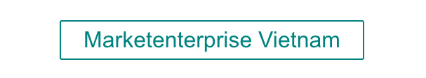
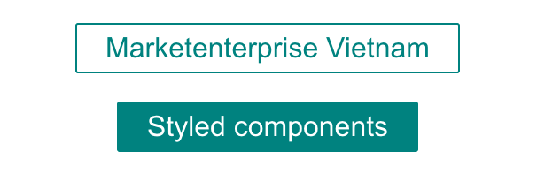
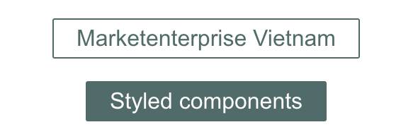
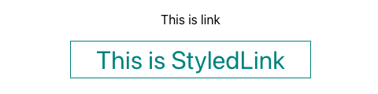
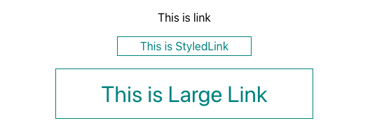

# CSS-in-JS và Styled-components

status: review
topic: frontend

Các thư viện CSS-in-JS đã và đang nhận được nhiều sự quan tâm kể từ khi các framework JavaScript dựa trên component xuất hiện trong quy trình phát triển front-end. Chắc hẳn bạn đã từng nghe qua các thư viện như Styled-components, JSS hay Radium. Điểm chung của chúng là chúng đều là các thư viện CSS-in-JS. Vậy CSS-in-JS là gì?

Trong bài viết này, chúng ta cùng tìm hiểu lời giải cho câu hỏi trên và cúng tiếp cận một thư viện CSS-in-JS rất được yêu thích là Style-components để thấy được sức mạnh to lớn của chúng nhé!

# CSS-in-JS

Các framework JavaScript hiện đại như React, Vue, Angular,... Hầu hết đều được xây dựng dựa trên các `component`. Từ `component`, bạn có thể xây dựng toàn bộ một Single-page Application(SPA). Một `component` thường là một phần tử giao diện như button, pop-up, hay thanh điều hướng. Bạn chỉ cần tạo ra các `component` một lần, và có thể tái sử dụng chúng trong bất kỳ nơi nào trong trang web(hay ứng dụng).

Nhưng làm sao để tạo ra các component một cách hiệu quả? Nếu sử dụng các file css toàn cục thì rất khó để tránh sai sót trong quá trình phát triển. Vì tính chất [Specificity](https://developer.mozilla.org/en-US/docs/Web/CSS/Specificity) của CSS, các stylesheet có thể tải theo bất kì thứ tự nào và properties trong đó có thể ghi đè nhau bất cứ lúc nào. Quản lý Dependency cũng là một vấn đề khác khi làm việc với SPA, đặc biệt là các ứng dụng web phức tạp.

Đã có một số giải pháp được đưa ra để giải quyết vấn đề này, ví dụ như `scope` trong Vue, BEM, modules hóa với PostCSS,... Nhưng có thể nói, các thư viện CSS-in-JS đã đưa ra giải pháp ở cấp độ cao hơn để giải quyết vấn đề trên. Chúng cung cấp một cách cụ thể để sử dụng CSS trực tiếp trong file JS. Từ đó có thể khai thác được tính linh hoạt của JS và khắc phục được các vấn đề đã nêu với CSS.

### Cách thức hoạt động của CSS-in-JS

Lấy ví dụ với Styled-components:

```jsx
import styled from 'styled-components';

const Text = styled.h2`
  color: #212121,
`

<Text>Hello Marketenterprise Vietnam</Text>
```

Đoạn code trên sẽ cho kết quả trên browser như sau:

```jsx
<style>
.fWxBIM {
  color: #212121;
}
</style>

<h2 class="fWxBIM">Hello Marketenterprise Vietnam</p>
```

Trong đoạn code trên đã tạo ra một class `fWxBIM` và gắn thẻ `<style>` ở phần trên của DOM. Mặc dù đây là cách tuyệt vời để tạo ra một class riêng biệt, không trùng lặp với bất kỳ một đối tượng nào khác, và hầu hết các thư viện CSS-in-JS nổi tiếng đều sử dụng cách này.

Tuy nhiên, vẫn có một số library chọn cách thêm trực tiếp CSS vào HTML thay vì tạo ra các class duy nhất, điển hình trong nhóm này là [Radium](https://github.com/FormidableLabs/radium).

Ngoài ra, một số thư viện chỉ hỗ trợ một hoặc một số framework cụ thể, như `Radium`, `Styled-JSX` chỉ hỗ trợ những ứng dụng `React`, `JSX`(Framework-Specific). Một số thư viện khác lại có bản chất là JavaScript thuần, nên có thể ứng dụng được cho nhiều framework component(Framework-Agnostic). Nổi bật trong nhóm này là `Emotion`, `JSS`.

Và tất nhiên, các thư viện CSS-in-JS khác nhau về cả chức năng và độ hỗ trợ lập trình viên. Tuy cùng giải quyết một vấn đề, nhưng một số thư viện có các chức năng đặc thù, riêng biệt mà hiếm được bắt gặp ở các thư viện khác, ví dụ như: global selector; caching; client hay SSR, hoặc cả hai.

Tóm lại, các thư viện CSS-in-JS rất đa dạng, chúng khác nhau về cả syntax, cách thức hoạt động, framework hỗ trợ, xử lý scope và cả chức năng nữa. Các bạn có thể tham khảo một số thư viện CSS-in-JS [tại đây](https://github.com/michelebertoli/css-in-js#features).

### Những ưu điểm của CSS-in-JS

Ở đây mình chỉ nêu ra những ưu điểm rõ ràng nhất của CSS-in-JS:

- **Phạm vi CSS cục bộ(local scoping)**: như đã phân tích ở trên, local scoping hạn chế hiệu lực của CSS trong phạm vi component. Từ đó tránh ghi đè CSS giữa các component.
- **Tận dụng các kỹ thuật, syntax JS**: Cơ bản CSS-in-JS là Javascript. Nghĩa là bạn có thể ứng dụng các kỹ thuật Javascript, như vòng lặp, câu lệnh điều kiện, biến,... vào để hỗ trợ styling. Đây là điều khiến CSS-in-JS cực kỳ linh hoạt và trong khi vẫn tốn cực ít code.
- **Đóng gói**: các component được "đóng gói" cẩn thận và chỉ public một số API để tương tác với các thành phần khác. Tính năng thuận tiện cho việc bảo trì code hạn chế lỗi nếu muốn có thay đổi trong một component, không ảnh hưởng tới các phần khác của ứng dụng.
- **Di động:** Vì mỗi component bao gồm tất cả source code, CSS, và logic cần để chạy đúng trong một file/folder, chúng ta có thể di chuyển chúng tới bất cứ đâu trong source code ứng dụng một cách an toàn.
- **Tái sử dụng**: Tất nhiên rồi, vì được viết dựa trên nguyên tắc component, nên chúng ta có thể tái sử dụng chúng ở bất cứ đâu.

### Nhược điểm

Mặc dù rất nhiều ưu điểm đã kể, CSS-in-JS vẫn có nhiều điểm mà bạn cần lưu ý nếu có ý định dùng chúng trong dự án của mình:

- Thời gian học: bạn chắc chắn phải bỏ ra thời gian học tập và làm quen với CSS-in-JS. Đặc biệt là những người lần đầu tiếp xúc với các framework component hoặc web component. Đây không chỉ là học cú pháp, mà còn là làm quen với lối tư duy mới, và có thể làm chậm thời gian phát triển ở lúc bắt đầu.
- Làm phức tạp dự án: CSS-in-JS sẽ đưa thêm một layer vào front-end stack. Điều này đôi khi không cần thiết ở các dự án đơn giản.
- Code tương đối khó đọc nếu trong team có những thành viên chưa làm quen với CSS-in-JS trước đó. Mặt khác, đôi khi việc debug cũng trở nên khó khăn đối với newbie.

Tóm lại, nên dựa vào nhiều yếu tố như thành viên trong team, tính chất dự án, thời gian phát triển để đưa ra quyết định có nên dùng CSS-in-JS hay không. Các bạn có thể tham khảo sâu hơn về chủ đề này [tại đây](https://medium.com/free-code-camp/the-tradeoffs-of-css-in-js-bee5cf926fdb) nhé!

# Styled-components

Ở phần này, chúng ta sẽ cùng tìm hiểu về Styled-components - thư viện CSS-in-JS đang được yêu thích nhất. Styled-component mặc định hỗ trợ React component, nhưng cũng có phiên bản [dành cho Vue](https://github.com/styled-components/vue-styled-components). Trong phạm vi bài viết này, mình chỉ lấy ví dụ React thôi nhé!

### Cài đặt

Styled-components có thể cài đặt bằng npm hoặc yarn:

```bash
# with npm
npm install styled-components

# with yarn
yarn add styled-components
```

Và có thể sử dụng trong dự án như sau:

```jsx
import styled from "styled-components";
```

### Sử dụng cơ bản

Bên dưới là cách sử dụng Styled-components cơ bản để tạo kiểu cho một button:

```jsx
import styled from "styled-components";

const StyledButton = styled.button`
  background: white;
  color: teal;

  font-size: 2em;
  margin: 1em;
  padding: 0.25em 1em;
  border: 2px solid teal;
  border-radius: 3px;
`;

function App() {
  return (
    <div className="App">
      <StyledButton>Marketenterprise Vietnam</StyledButton>
    </div>
  );
}
```

Đoạn code trên sẽ cho kết quả sau:



Với đoạn mã trên thì chúng ta có được một `functional component` có tên là `StyledButton` và component này sẽ render ra thẻ `button`. Nhưng so với cách thông thường thì với cách viết khi sử dụng Styled-components này, style sẽ được viết luôn bên trong component. Component `StyledButton` tạo ra hoàn toàn giống các component bằng cách tạo bình thường, sẽ có children, props truyền vào, chỉ khác một điểm là chúng ta được viết style bên trong nó.

### Sử dụng props

Như vừa nói ở trên, một component tạo ra từ Styled-components cũng có props như componen thông thường. Chỉnh sửa đoạn code trên trở thành như sau:

```jsx
const StyledButton = styled.button`
  background: ${(props) => (props.primary ? "teal" : "white")};
  color: ${(props) => (props.primary ? "white" : "teal")};

  font-size: 2em;
  margin: 0.5em;
  padding: 0.25em 1em;
  border: 2px solid teal;
  border-radius: 3px;
`;

function App() {
  return (
    <div className="App">
      <StyledButton>Marketenterprise Vietnam</StyledButton>
      <StyledButton primary>Styled components</StyledButton>
    </div>
  );
}
```

Đoạn code trên cho kết quả như sau:



Ở button thứ nhất: không có props `primary` nên nhận các property `backgroud: white;` và `color: teal;`

Ở button thứ hai: có props `primary` nên sẽ nhận các property `backgroud: teal;` và `color: white;`

### Pseudo-elements, pseudo-selectors và nesting

Styles bên trong component hỗ trợ cú pháp tương tự cú pháp SCSS để tự động xử lý các style lồng nhau. Khi đó, ký tự `&` được sử dụng để chỉ định component hiện tại:

```jsx
const StyledButton = styled.button`
  background: ${(props) => (props.primary ? "teal" : "white")};
  color: ${(props) => (props.primary ? "white" : "teal")};

  font-size: 2em;
  margin: 0.5em;
  padding: 0.25em 1em;
  border: 2px solid teal;
  border-radius: 3px;

  &:hover {
    opacity: 0.8;
    cursor: pointer;
  }
`;

const Container = styled.div`
  display: flex;
  width: 100vw;
  height: 100vh;
  align-items: center;
  justify-content: center;
  flex-direction: column;

  ${StyledButton} {
    filter: grayscale(0.8);
  }
`;

function App() {
  return (
    <Container className="App">
      <StyledButton>Marketenterprise Vietnam</StyledButton>
      <StyledButton primary>Styled components</StyledButton>
    </Container>
  );
}
```

Kết quả:



### Tạo kiểu bất cứ component nào!

Cùng theo dõi ví dụ sau:

```jsx
const Link = ({ className, children }) => (
  <a className={className}>{children}</a>
);

const StyledLink = styled(Link)`
  color: teal;
  font-size: 2rem;
  text-decoration: teal;
  padding: 0.25rem 2rem;
  border: 1px solid teal;
`;

function App() {
  return (
    <Container className="App">
      <Link>This is link</Link>
      <br />
      <StyledLink>This is Link</StyledLink>
    </Container>
  );
}
```

Cho ra kết quả:



Trong ví dụ trên, component `Link` chỉ trả về một thẻ `a` và không có bất cứ style nào. Component `StyledLink` "kế thừa" component `Link` và override style và có khả năng override các attribute của `Link` .

Chúng ta cũng có thể chỉnh sửa `StyledLink` lại một chút để có thể sử dụng props dễ dàng hơn:

```jsx
const StyledLink = styled((props) => <Link size="large" {...props} />)`
  color: teal;

  text-decoration: teal;
  border: 1px solid teal;

  font-size: ${(props) => (props.size === "large" ? "2rem" : "1rem")};
  padding: ${(props) =>
    props.size === "large" ? "1rem 4rem" : "0.25rem 2rem"};
`;

function App() {
  return (
    <Container className="App">
      <Link>This is link</Link>
      <br />
      <StyledLink>This is StyledLink</StyledLink>
      <br />
      <StyledLink size="large">This is Large Link</StyledLink>
    </Container>
  );
}
```

Kết quả:



Đoạn code trên cho phép style lại một component và cho phép truyền props, đồng thời styling dynamic theo props truyền vào. Cực kỳ linh hoạt nhỉ!

### Sử dụng nâng cao

Trên đây chúng ta đã cùng dùng thử một vài tính năng cơ bản của Styled-components. Rất thú vị và mạnh mẽ đúng không nào! Các bạn có thể tham khảo thêm rất nhiều tính năng hay ho khác của thư viện này tại trang chủ của Styled-components [tại đây](https://styled-components.com) nhé!

# Kết

Tóm lại, các thư viện CSS-in-JS là tuy là một chủ đề nhạy cảm và gây nhiều tranh cãi, nhưng không thể phủ nhận, nó đã đưa kỹ thuật modules hóa CSS lên bước phát triển tiếp theo. Nổi bật trong số đó là Styled-components - một thư viện CSS-in-JS cực kỳ linh hoạt và mạnh mẽ.

Nếu bạn đang gặp vấn đề với cách tổ chức CSS trong với ứng dụng SPA của mình, hãy thử cân nhắc tới việc dùng Styled-components nhé. Biết đâu bạn cũng sẽ sớm trở hành fan như mình vậy 😁

### Link tham khảo

- Styled-components docs: [https://styled-components.com](https://styled-components.com/docs/basics)
- Why CSS-in-JS awesome: [https://mxstbr.com/thoughts/css-in-js/](https://mxstbr.com/thoughts/css-in-js/)
- CSS in JS: Benefits, Drawbacks, and Tooling: [CSS in JS: Benefits, Drawbacks, and Tooling](https://medium.com/object-partners/css-in-js-benefits-drawback-and-tooling-80286b03f9aa)
- The tradeoffs of CSS-in-JS: [https://www.freecodecamp.org/news/the-tradeoffs-of-css-in-js-bee5cf926fdb/](https://www.freecodecamp.org/news/the-tradeoffs-of-css-in-js-bee5cf926fdb/)
- CSS evolution: [https://medium.com/@perezpriego7/css-evolution-from-css-sass-bem-css-modules-to-styled-components-d4c1da3a659b](https://medium.com/@perezpriego7/css-evolution-from-css-sass-bem-css-modules-to-styled-components-d4c1da3a659b)
